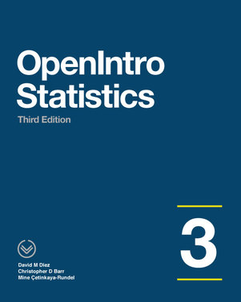

    

---

Want to see how stats is done with a programming language? Click  to launch a fully functioning version of these Python Jupyter Notebooks that you can play around with yourself! 
It's Easy!   
Once Binder loads in your browser window(it'll take a minute): 
 - click `serge_notebooks` and choose a notebook (`chap_1.ipynb` or `chap_1_exercises.ipynb`, etc) 
 - wait for Jupyter Notebook to open and load
 - next click `run cells` or `Shift+Enter` to run the cells and see the outputs
 - follow along with the [book](https://github.com/ukrainian-serge/open_intro_statistics/blob/master/assets/os3.pdf) by clicking the hyperlink headers in the Jupyter Notebook. 

---

<a href="https://www.openintro.org/">OpenIntro Stats</a> is a free and widely used book containing an introduction into the world of statistics using R language exclusively. The goal of the project is to deepen my knowledge of Python as pertained to statistics and to provide my solutions to individuals that also want to study OpenIntro Stats but want to see a Pythonic approach. This contains reproductions of ETL, EDA, various sampling and statistical methods, aesthetic visualizations with annotations, etc, using Python instead of R.

A copy of the book is contained in the repo [here](https://github.com/ukrainian-serge/open_intro_statistics/blob/master/assets/os3.pdf).

<h4>(This collection of notebooks are intended to be a follow-along with the material in the book.)</h4>

## Project tools:

- Python + pandas, Numpy, Matplotlib, etc.
- Jupyter Notebook
- Binder + Docker
